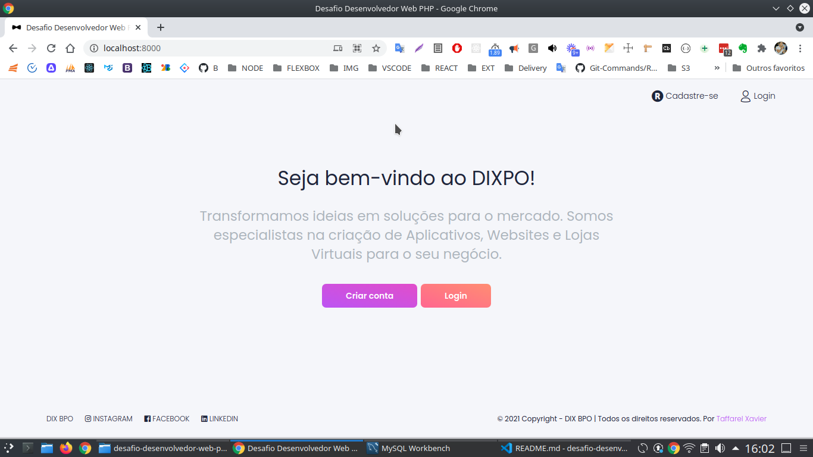

# Guia básico de Instalação.

Go 🚀

## Tela inicial



## Tela Login


✅ Para acessar, clone este repositório: 

```batch 
git clone https://github.com/TaffarelXavier/desafio-desenvolvedor-web-php.git
```

✅ Renomeie o arquivo `.env.example` para `.env` e criei definições de uso, como configuração de banco de dados.

✅ Importe as migrations
 ``` batch
php artisan migrate
```

Execute a seeder UsersTableSeeder
``` batch
php artisan db:seed --class=UsersTableSeeder
```

✅ Inicie o servidor com comando: 
``` batch 
php artisan serve
```

Em seguida, no navegador, por exemplo, http://localhost:8000/login, acesse a página *login*. 

✅ Faça o login com as credenciais:

    - Usuário: admin@white.com
    - Senha: secret

# Além dos desafios, foram criados:

- Níveis para os usuários;
    - Se o campo level for 0, então é administrador, caso contrário, é usuário normal, sem algumas funções.
- Modelo de Categoria e seu crud;
- Slug para as páginas;
- Estilização da página inicial;
- Correção de bug vindo do white-dashboard-laravel;
- Criação de footer;
- Controle de acesso.